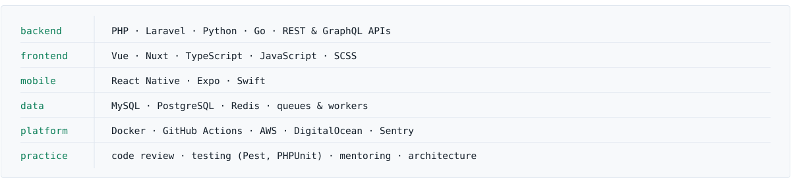
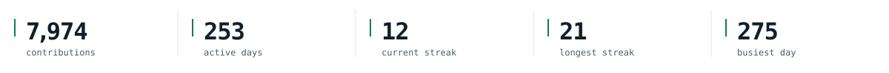

<picture>
  <source media="(prefers-color-scheme: dark) and (max-width: 600px)" srcset="./assets/banner-dark-sm.svg">
  <source media="(prefers-color-scheme: light) and (max-width: 600px)" srcset="./assets/banner-light-sm.svg">
  <source media="(prefers-color-scheme: dark)" srcset="./assets/banner-dark.svg">
  
</picture>

I work as **Tech Lead** and **Senior Software Engineer** at **[Hisoft](https://github.com/hisoft-br)** and **Podtech**, two companies under the same group. I take products from architecture to production — API design, web and mobile clients, and the pipelines and infrastructure that keep them running.

Most of my week goes into **[QuimeraX](https://quimerax.com)**, the Hakai group's threat intelligence platform — attack surface monitoring, leak and vulnerability detection, and takedown automation. The rest goes to **Fiscaliza** (civic inspection), **Acolher** (healthcare), **SIGRI** (institutional relations), and **[Verity](https://veritycash.com.br)** (AI for cash flow and financial intelligence).

The parts I actually care about are the ones that survive the first release: clear boundaries between modules, tests that catch something real, review culture, and making the engineers around me faster than they were last quarter.

## Stack

<picture>
  <source media="(prefers-color-scheme: dark) and (max-width: 600px)" srcset="./assets/stack-dark-sm.svg">
  <source media="(prefers-color-scheme: light) and (max-width: 600px)" srcset="./assets/stack-light-sm.svg">
  <source media="(prefers-color-scheme: dark)" srcset="./assets/stack-dark.svg">
  
</picture>

## Activity

<picture>
  <source media="(prefers-color-scheme: dark) and (max-width: 600px)" srcset="./assets/signal-dark-sm.svg">
  <source media="(prefers-color-scheme: light) and (max-width: 600px)" srcset="./assets/signal-light-sm.svg">
  <source media="(prefers-color-scheme: dark)" srcset="./assets/signal-dark.svg">
  
</picture>

<picture>
  <source media="(prefers-color-scheme: dark)" srcset="https://raw.githubusercontent.com/Douglas-Strey/Douglas-Strey/output/snake-dark.svg">
  
</picture>

## Elsewhere

[douglasstrey.com](https://douglasstrey.com/) · [LinkedIn](https://www.linkedin.com/in/douglas-strey/) · [douglas.strey@outlook.com](mailto:douglas.strey@outlook.com)
